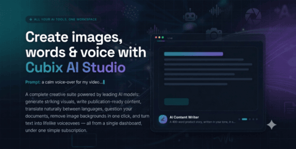
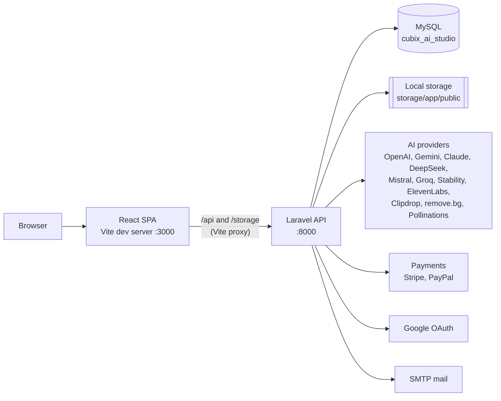
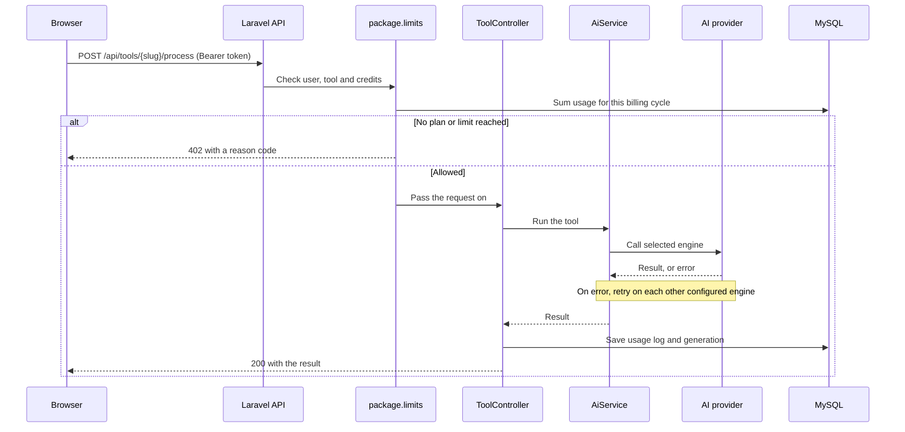

# Cubix AI Studio



Cubix AI Studio is a subscription-based AI tools platform. Visitors use a set of AI tools (image generation, writing, translation, document Q&A and more) from a public website, customers buy monthly or yearly plans with credit limits, and an administrator manages everything — tools, AI engines, API keys, plans, customers, pages, menus and translations — from a built-in admin panel.

The project has two parts:

| Part | Stack | Runs on |
|---|---|---|
| [backend/](backend/) | Laravel 12 REST API (PHP) | http://127.0.0.1:8000 |
| [frontend/](frontend/) | React 18 single-page app (Vite) | http://localhost:3000 |

Screenshots of every screen are in [Cubix-AI-Studio-Screen-Shots/](Cubix-AI-Studio-Screen-Shots/). Release notes are in [CHANGELOG.md](CHANGELOG.md).

## Contents

- [Features](#features)
- [Requirements](#requirements)
- [Setup from scratch](#setup-from-scratch)
- [Running the project day to day](#running-the-project-day-to-day)
- [Configuration after install](#configuration-after-install)
- [System architecture](#system-architecture)
- [Project structure](#project-structure)
- [Deploying to production](#deploying-to-production)
- [Troubleshooting](#troubleshooting)

## Features

**AI tools (9)**

| Tool | Slug |
|---|---|
| AI Image Generator | `ai-image-generator` |
| AI Content Writer | `ai-content-writer` |
| AI Translator | `ai-translator` |
| AI Document Assistant (PDF, Word, text) | `ai-document-assistant` |
| AI Background Removal | `ai-background-removal` |
| AI Text-to-Audio | `ai-text-to-audio` |
| AI Chat Assistant | `ai-chat-assistant` |
| AI Grammar & Rewriter | `ai-text-rewriter` |
| AI Summarizer | `ai-summarizer` |

**AI engines.** Each tool can use a different engine: OpenAI, Google Gemini, Anthropic Claude, DeepSeek, Mistral, Groq, Stable Diffusion, ElevenLabs, Clipdrop and remove.bg. If the selected engine fails, the request is retried on every other configured engine before an error is shown. Image generation also has a free engine (Pollinations) that needs no API key.

**Subscriptions and payments.** Monthly and yearly plans, per-tool credit limits, unlimited-credit toggles, private custom packages, per-plan browser-login limits and usage history. Payments go through Stripe and/or PayPal. A tool can also be opened in "free mode" with a daily or monthly use limit for signed-in users without a plan.

**Admin panel.** Dashboard with charts, customers, packages, subscriptions, usage logs, tool manager, AI engine and API key manager with live key testing, page builder with shortcodes, drag-and-drop menu builder, taxonomies, testimonials, contact messages, languages, appearance and settings.

**Storefront.** Multi-language with RTL support (English, Spanish, French, Arabic and Mandarin Chinese ship with the demo data), dark and light themes with admin-configurable colors, Google sign-in (optional) and email verification.

## Requirements

| Software | Version | Notes |
|---|---|---|
| PHP | 8.2 or newer | Tested on 8.4 |
| Composer | 2.x | |
| Node.js | 18, 20 or 22 (LTS) | Tested on 22 |
| npm | Ships with Node.js | |
| MySQL or MariaDB | MySQL 8 / MariaDB 10.4+ | XAMPP's bundled MariaDB works |
| Git | Any recent version | |

**PHP extensions** (enable in `php.ini`): `curl`, `fileinfo`, `gd`, `mbstring`, `openssl`, `pdo_mysql`, `zip`.

**Recommended `php.ini` values** (needed for document uploads and slow AI calls):

```ini
upload_max_filesize = 20M
post_max_size = 25M
max_execution_time = 300
```

**Ports.** 8000 (API), 3000 (website) and 3306 (database) must be free.

**Internet access** is needed at runtime, because the AI tools call third-party provider APIs.

**External accounts** (all optional for a first run):

- One AI key for the text tools — Google Gemini and Groq both offer free keys.
- Stripe and/or PayPal, to sell plans.
- A Google OAuth client, for Google sign-in.
- SMTP credentials, to send real email. By default email is written to the log file.

Check your tools before starting:

```bash
php -v
composer -V
node -v
npm -v
```

## Setup from scratch

The commands below are written for Windows with XAMPP, but work the same on macOS and Linux.

### 1. Get the code

```bash
git clone <repository-url> cubix-ai-studio
cd cubix-ai-studio
```

### 2. Create the database

Start MySQL (in XAMPP: press **Start** next to MySQL), then create an empty database named `cubix_ai_studio` with collation `utf8mb4_unicode_ci`. In phpMyAdmin use **New**, or run:

```sql
CREATE DATABASE cubix_ai_studio CHARACTER SET utf8mb4 COLLATE utf8mb4_unicode_ci;
```

### 3. Set up the backend

```bash
cd backend
composer install
```

Create the environment file and an application key:

```bash
cp .env.example .env        # Windows Command Prompt: copy .env.example .env
php artisan key:generate
```

Open `backend/.env` and check these values match your machine:

```env
APP_URL=http://127.0.0.1:8000
FRONTEND_URL=http://localhost:3000

DB_CONNECTION=mysql
DB_HOST=127.0.0.1
DB_PORT=3306
DB_DATABASE=cubix_ai_studio
DB_USERNAME=root
DB_PASSWORD=
```

XAMPP's MySQL user is `root` with an empty password by default.

Link the storage folder (generated images are served from it), then create the tables and load the demo content:

```bash
php artisan storage:link
php artisan demo:install
```

Answer `yes` when asked. `demo:install` runs every migration, then seeds the 9 tools, plans, pages, menu, languages, testimonials and four demo accounts.

> **Warning:** `demo:install` deletes everything in the database before reinstalling. Only use it on a new or disposable database. To create the tables without demo data, run `php artisan migrate` instead.

Start the API:

```bash
php artisan serve --port=8000
```

Leave this terminal open. Open http://127.0.0.1:8000/up to confirm the API is running.

### 4. Set up the frontend

In a second terminal:

```bash
cd frontend
npm install
npm run dev
```

Open http://localhost:3000.

### 5. Sign in

| Account | Email | Password |
|---|---|---|
| Admin | admin@example.com | password |
| Demo customer | maya@example.com | password |
| Demo customer | liam@example.com | password |
| Demo customer | fatima@example.com | password |

The admin panel is at http://localhost:3000/admin. Change the admin password before any real use (Account → Password).

## Running the project day to day

Once set up, you only need MySQL running and two terminals:

```bash
# Terminal 1
cd backend
php artisan serve --port=8000

# Terminal 2
cd frontend
npm run dev
```

After pulling new code, run `composer install` and `php artisan migrate` in `backend/`, and `npm install` in `frontend/`.

## Configuration after install

Almost everything is configured in the admin panel and stored in the database, not in `.env`.

| What | Where |
|---|---|
| AI API keys (with a **Test** button per key) | Admin → AI Settings → API Keys |
| Which engine each tool uses | Admin → AI Settings → AI Engines |
| Stripe and PayPal keys, test or live mode | Admin → Settings → Payments |
| Google sign-in | Admin → Settings → Sign-in options |
| Site name, logo, colors, themes | Admin → Appearance / Settings |
| Languages and translations | Admin → Languages |
| Plans and credit limits | Admin → Packages |

**Text tools need one AI key.** The image generator works without a key. For the text tools, get a free key from [Google AI Studio](https://aistudio.google.com) (Gemini) or [Groq](https://console.groq.com), paste it under API Keys, press **Test**, save, then select that engine under AI Engines.

**Stripe.** Paste the test secret key (`sk_test_…`) under Payments. No Stripe Price IDs are needed; prices come from your packages. For live sites, add a webhook to `https://YOUR-API-DOMAIN/api/billing/webhook/stripe` with the events `checkout.session.completed`, `invoice.payment_succeeded` and `customer.subscription.deleted`. On localhost the webhook is not needed, because the plan is activated when the customer returns from checkout.

**PayPal.** Create an app at [developer.paypal.com](https://developer.paypal.com) and paste the Client ID and Secret under Payments.

**Google sign-in.** Create an OAuth client (Web application) with the redirect URI `http://127.0.0.1:8000/api/auth/google/callback`.

**Email.** Mail is written to `backend/storage/logs/laravel.log` by default. Set the `MAIL_*` values in `backend/.env` to send real email.

## System architecture

### Overview

The frontend is a static single-page app that talks to the backend only through a JSON REST API. The backend owns all business logic, the database, and every call to AI and payment providers. API keys never reach the browser.



In development, the Vite dev server forwards `/api` and `/storage` to the Laravel server, so the browser sees a single origin and no CORS setup is needed. In production the frontend is built to static files and calls the API at the address set in `VITE_API_URL`.

### Frontend

- **React 18** with **React Router 6** for routing, **Tailwind CSS 3** for styling, **Recharts** for the admin charts and **lucide-react** for icons.
- Three route groups in [frontend/src/App.jsx](frontend/src/App.jsx): public pages (`/`, `/tools`, `/tools/:slug`, `/pricing`, `/contact`, `/p/:slug`), auth pages (`/login`, `/register`) and the admin area (`/admin/*`). `RequireAuth` and `RequireAdmin` guard the private routes.
- [frontend/src/lib/api.js](frontend/src/lib/api.js) is the single API client. It attaches the bearer token and applies the admin's brand and theme colors as CSS variables.
- `AuthContext` holds the signed-in user; `LanguageContext` holds the active language and translations.
- Tool input forms are rendered from definitions sent by the API (`DynamicForm`), so tools can be adjusted from the admin panel without frontend changes.

### Backend

- **Laravel 12** exposing a JSON API under `/api`, defined in [backend/routes/api.php](backend/routes/api.php).
- **Authentication:** Laravel Sanctum personal access tokens. The token is returned at login, stored in the browser's `localStorage`, and sent as an `Authorization: Bearer` header.
- **Route layers:**
  - Public — branding, packages, public tool list, pages, menu, languages, testimonials, contact, register and login, payment return URLs and the Stripe webhook.
  - Authenticated (`auth:sanctum`) — tools, generation history, account, checkout.
  - Admin (`auth:sanctum` + `admin`) — everything under `/api/admin`.
- **Middleware:**
  - `admin` ([EnsureUserIsAdmin](backend/app/Http/Middleware/EnsureUserIsAdmin.php)) restricts the admin routes.
  - `package.limits` ([EnforcePackageLimits](backend/app/Http/Middleware/EnforcePackageLimits.php)) runs before every tool request. It rejects blocked users and inactive tools, then checks the user's credits for the current billing cycle, or the tool's free-mode limit if the user has no plan.
- **Services** in [backend/app/Services/](backend/app/Services/):
  - `AI/AiService` — runs every tool, chooses the engine, and falls back across engines on failure.
  - `SettingsService` — reads settings and API keys from the database.
  - `NotificationService` — email notifications.
  - `AutoTranslateService`, `UiStrings`, `UiTranslations`, `ContentTranslations` — the translation system.
- **Scheduled job:** `subscriptions:send-expiry-reminders` runs daily at 09:00 and needs the Laravel scheduler (see [Deploying to production](#deploying-to-production)).

### How a tool request flows



### Data model

| Table | Purpose |
|---|---|
| `users` | Accounts, with `role` (`admin` or `customer`) and blocked status |
| `personal_access_tokens` | Sanctum login tokens |
| `packages` | Plans: price, billing period, per-tool credit limits |
| `subscriptions` | A user's plan, its status, and Stripe or PayPal references |
| `usage_logs` | One row per tool use; the basis for credit checks |
| `generations` | Saved tool outputs (per-user history) |
| `ai_tools` | The tools, their status, form definition and free-mode settings |
| `settings` | Key/value store for all admin settings, including API keys |
| `languages` | Enabled languages and their translations |
| `site_pages`, `menu_items` | CMS pages and navigation |
| `taxonomies`, `testimonials`, `contact_messages` | Categories, reviews and contact form submissions |

Generated files such as images and audio are saved to `backend/storage/app/public` and served through the `/storage` link.

## Project structure

```
.
├── backend/                    Laravel 12 API
│   ├── app/
│   │   ├── Console/Commands/   demo:install, expiry reminders
│   │   ├── Http/Controllers/Api/        Public and customer endpoints
│   │   ├── Http/Controllers/Api/Admin/  Admin endpoints
│   │   ├── Http/Middleware/    admin, package.limits
│   │   ├── Models/
│   │   └── Services/           AI, settings, notifications, translations
│   ├── bootstrap/app.php       Routing and middleware registration
│   ├── database/migrations/
│   ├── database/seeders/       Tools, languages, pages, demo data
│   ├── routes/api.php          All API routes
│   └── .env.example
├── frontend/                   React SPA
│   ├── src/
│   │   ├── components/         Layouts, forms, pricing, admin widgets
│   │   ├── context/            Auth and language state
│   │   ├── lib/api.js          API client
│   │   └── pages/              public/, admin/, account, auth
│   ├── public/art/             Artwork and provider logos
│   └── vite.config.js          Dev port and API proxy
├── Cubix-AI-Studio-Screen-Shots/
├── CHANGELOG.md
└── README.md
```

## Deploying to production

1. **Backend.** Use any host with PHP 8.2+ and MySQL. Upload `backend/`, point the API domain at `backend/public`, and set `.env`:

   ```env
   APP_ENV=production
   APP_DEBUG=false
   APP_URL=https://api.yourdomain.com
   FRONTEND_URL=https://yourdomain.com
   ```

   Add the real database and SMTP values, then run:

   ```bash
   composer install --no-dev --optimize-autoloader
   php artisan key:generate
   php artisan migrate --force
   php artisan db:seed --force
   php artisan storage:link
   ```

2. **Frontend.** Create `frontend/.env` with the API address, build, and upload the `dist` folder to your web root:

   ```env
   VITE_API_URL=https://api.yourdomain.com/api
   ```

   ```bash
   npm run build
   ```

   Because the app uses client-side routing, configure the web server to serve `index.html` for unknown paths.

3. **Scheduler.** Add a cron entry so the expiry reminder emails are sent:

   ```
   * * * * * php /path-to-app/artisan schedule:run >> /dev/null 2>&1
   ```

4. **Payments.** Switch Stripe and PayPal to live keys and add the Stripe webhook.

5. **Security.** Change the default admin password and remove the demo customer accounts.

## Troubleshooting

| Problem | Fix |
|---|---|
| `Failed to listen on 127.0.0.1:8000` | The port is usually already in use by another `php artisan serve`. Stop it, or use `php artisan serve --port=8001` and change the proxy target in [frontend/vite.config.js](frontend/vite.config.js). If the port is free, try `php artisan serve --port=8000 --no-reload`. |
| `Port 3000 is already in use` | Another dev server is running. Stop it, or change `port` in [frontend/vite.config.js](frontend/vite.config.js) and `FRONTEND_URL` in `backend/.env`. |
| `could not find driver` | Enable `extension=pdo_mysql` in `php.ini` and restart the API. |
| `Access denied for user 'root'` | MySQL is not running, or the password in `backend/.env` is wrong. |
| `Unknown database` | Create the database (step 2), or fix `DB_DATABASE` in `backend/.env`. |
| Website loads but shows no data | The API is not running. Check http://127.0.0.1:8000/up. |
| Images generate but do not display | Run `php artisan storage:link`. |
| "No text engine is set up yet" | Add an AI key under Admin → AI Settings → API Keys. |
| `Maximum execution time` errors | Raise `max_execution_time` in `php.ini` and restart the API. |
| Uploads fail in the Document Assistant | Raise `upload_max_filesize` and `post_max_size` in `php.ini`. |
| Changes to `.env` are ignored | Run `php artisan config:clear` and restart the API. |
| Emails do not arrive | They are written to `backend/storage/logs/laravel.log` until `MAIL_*` is configured. |
| Anything else | Check `backend/storage/logs/laravel.log`. |
